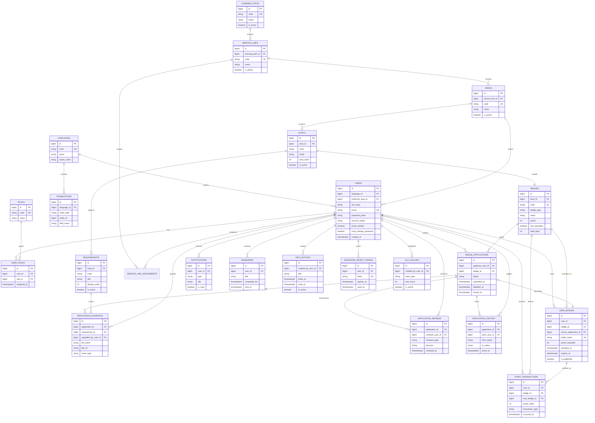

# Fase 1 - ERD e Modelo de Dados

## Entidades principais

- users
- roles
- user_roles
- learning_paths
- service_lines
- areas
- levels
- badges
- requirements
- badge_applications
- application_evidences
- application_reviews
- application_history
- user_badges
- point_transactions
- notifications
- reminders
- info_notices
- sla_policies
- password_reset_tokens
- translations
- languages

## Mermaid ER Diagram

## Regras de modelacao mais importantes

### Badge por nivel

- Cada nivel tem exatamente um badge principal.
- Isto fica garantido com `badges.level_id unique`.

### Candidatura com workflow auditavel

- `badge_applications` guarda o estado atual.
- `application_reviews` guarda as decisoes do Talent Manager e do Service Line Leader.
- `application_history` guarda cada transicao de estado para auditoria.

### Evidencias por requisito

- Uma candidatura pode ter varias evidencias.
- Cada evidencia pode ser associada ao requisito que pretende comprovar.

### Badge atribuido e pagina publica

- `user_badges.public_token` e o identificador publico da pagina de verificacao.
- `is_published` controla se o badge esta ou nao exposto publicamente.

### Pontos imutaveis

- `points_awarded` em `user_badges` preserva os pontos atribuidos na data da aprovacao.
- `point_transactions` garante historico financeiro do sistema de gamification.

### Scoping por service line

- `service_line_assignments` define que leaders podem operar sobre que service lines.
- Para Talent Manager, o acesso global pode ser tratado em autorizacao por role, sem depender desta tabela.