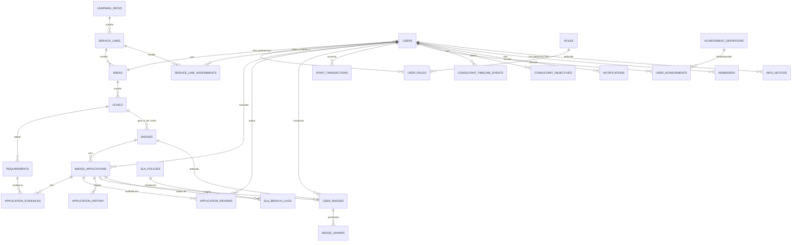

# 🗂️ Modelo Conceptual de Dados — PINT 2025 (Plataforma de Badges Softinsa)

> Reconstruído a partir do **schema real do backend** (PostgreSQL/Neon, dump `15_05.sql`).
> A base de dados é **única e partilhada** pela aplicação **Web** e **Mobile** (o mobile consome a mesma API).
> Atualizado: Junho 2026.

---

## 🔖 Tipos de domínio (ENUMs)

| Tipo | Valores |
|---|---|
| `account_status_t` | pending_confirmation · active · inactive · suspended |
| `application_status_t` | open · submitted · in_validation · closed |
| `application_result_t` | approved · rejected |
| `review_decision_t` | forward · send_back · approve · reject |
| `reviewer_type_t` | talent_manager · service_line_leader |
| `badge_type_t` | level · special · premium |
| `points_tx_type_t` | badge_award · achievement_bonus · manual_credit · manual_debit |
| `notification_type_t` | application_submitted · application_forwarded · application_approved · application_rejected · application_send_back · badge_awarded · badge_expiring · badge_expired · sla_warning · sla_breach · reminder · announcement · system |
| `integration_provider_t` | teams · slack · webhook |
| `share_platform_t` | linkedin · email_signature · other |
| `sla_team_t` | talent_manager · service_line_leader |

---

## 🧭 Diagrama ER (núcleo)



---

## 📦 Entidades por domínio

### 1) Utilizadores & Acesso
- **USERS** — `id` PK · full_name · email · password_hash · account_status · email_verified · must_change_password · preferred_area_id (FK→AREAS) · language_id (FK→LANGUAGES) · rgpd_policy_id (FK→RGPD_POLICIES) · accepted_rgpd_at · first_login_at · last_login_at
- **ROLES** — `id` PK · code (consultant/talent_manager/service_line_leader/admin) · name
- **USER_ROLES** — `id` PK · user_id (FK) · role_id (FK) · is_active · assigned_by (FK→USERS) — *N:N entre USERS e ROLES*
- **SERVICE_LINE_ASSIGNMENTS** — `id` PK · user_id (FK) · service_line_id (FK) · assigned_by — *afetação de TM/SLL a uma Service Line*

### 2) Estrutura formativa (Learning Path → Badge)
- **LEARNING_PATHS** — `id` PK · code · name · is_active *(no projeto: "Jornada Técnica")*
- **SERVICE_LINES** — `id` PK · learning_path_id (FK) · code · name
- **AREAS** — `id` PK · service_line_id (FK) · code · name
- **LEVELS** — `id` PK · area_id (FK) · code (A–E) · name (Júnior…Líder) · rank_order
- **REQUIREMENTS** — `id` PK · level_id (FK) · code (A1, A2…) · title · description · evidence_instructions · image_url · display_order
- **BADGES** — `id` PK · level_id (FK, *opcional* p/ special/premium) · code · badge_type · name · description · points · has_expiration · valid_days · has_completion_deadline · completion_days · is_active

### 3) Candidaturas (workflow de aprovação)
- **BADGE_APPLICATIONS** — `id` PK · applicant_user_id (FK→USERS) · badge_id (FK) · status (`application_status_t`) · final_result (`application_result_t`) · final_comment · submitted_at · deadline_at · approved_at · closed_at
- **APPLICATION_EVIDENCES** — `id` PK · application_id (FK) · requirement_id (FK) · uploaded_by_user_id (FK) · file_name · storage_key · file_url · mime_type · size_bytes
- **APPLICATION_REVIEWS** — `id` PK · application_id (FK) · reviewer_user_id (FK) · reviewer_type (`reviewer_type_t`) · decision (`review_decision_t`) · comment · reviewed_at — *quem avaliou e quando*
- **APPLICATION_HISTORY** — `id` PK · application_id (FK) · actor_user_id (FK) · from_status · to_status · event_type · comment · occurred_at — *auditoria do workflow*

### 4) Badges conquistados & partilha
- **USER_BADGES** — `id` PK · user_id (FK) · badge_id (FK) · source_application_id (FK→BADGE_APPLICATIONS) · awarded_at · expires_at · is_published · rgpd_accepted · points_awarded · public_token · linkedin_shared_at · certificate_url
- **BADGE_SHARES** — `id` PK · user_badge_id (FK) · platform (`share_platform_t`) · share_url · shared_at

### 5) Gamificação
- **POINT_TRANSACTIONS** — `id` PK · user_id (FK) · badge_id / user_badge_id / achievement_id (FKs) · transaction_type (`points_tx_type_t`) · points_delta · balance_after · note
- **ACHIEVEMENT_DEFINITIONS** — `id` PK · code · name · description · badge_id (FK) · points_bonus · rule_config (jsonb) · is_active
- **USER_ACHIEVEMENTS** — `id` PK · user_id (FK) · achievement_definition_id (FK) · trigger_context · celebrated · awarded_at
- **CONSULTANT_TIMELINE_EVENTS** — `id` PK · user_id (FK) · event_type · title · related_badge_id / related_user_badge_id (FKs) · event_date · is_public
- **CONSULTANT_OBJECTIVES** — `id` PK · user_id (FK) · target_badge_id (FK) · title · target_date · completed_at

### 6) Comunicação
- **NOTIFICATIONS** — `id` PK · user_id (FK) · type (`notification_type_t`) · title · message · payload · is_read · sent_at
- **REMINDERS** — `id` PK · user_id (FK) · created_by (FK) · title · message · related_entity · related_id · scheduled_for · dismissed_at
- **INFO_NOTICES** — `id` PK · created_by_user_id (FK) · title · content · target_roles (text[]) · is_active · starts_at · ends_at — *avisos da plataforma*

### 7) SLA & Integrações
- **SLA_POLICIES** — `id` PK · created_by_user_id (FK) · team_type (`sla_team_t`) · limit_hours · warning_at_percent · is_active
- **SLA_BREACH_LOGS** — monitorização de incumprimento de SLA (liga a SLA_POLICIES e BADGE_APPLICATIONS)
- **INTEGRATION_CONFIGS** — `id` PK · provider (`integration_provider_t`) · config (jsonb, ex: webhook_url) · event_types (text[]) · is_active

### 8) Configuração, RGPD & Certificados
- **RGPD_POLICIES** — `id` PK · version · content · is_current · effective_from
- **CERTIFICATE_TEMPLATES** — `id` PK · badge_type · name · template_url · config · is_default
- **EMAIL_TEMPLATES** — modelos de email
- **PLATFORM_CONFIG** — `id` PK · config_key · config_value (configuração global, ex: sistema de pontos)

### 9) Internacionalização (i18n)
- **LANGUAGES** — `id` PK · code (pt/en/es) · name · native_name
- **TRANSLATIONS** — traduções de conteúdos (FK→LANGUAGES)

### 10) Suporte técnico (não-domínio)
- **USER_SESSIONS** · **PASSWORD_RESET_TOKENS** · **EMAIL_VERIFICATION_TOKENS** · **PUSH_TOKENS** (ios/android) · **USER_PREFERENCES** · **USER_EMAIL_SIGNATURES** · **AUDIT_LOG**

---

## 🔗 Cardinalidades principais (resumo)

```
LEARNING_PATH 1 ── N SERVICE_LINE 1 ── N AREA 1 ── N LEVEL 1 ── N REQUIREMENT
LEVEL 1 ── N BADGE                       (1 badge por nível; special/premium podem não ter nível)
USER N ── N ROLE                         (via USER_ROLES)
USER 1 ── N BADGE_APPLICATION N ── 1 BADGE
BADGE_APPLICATION 1 ── N EVIDENCE        (cada evidência liga a 1 REQUIREMENT)
BADGE_APPLICATION 1 ── N REVIEW          (avaliador = USER; TM ou SLL)
BADGE_APPLICATION 1 ── N HISTORY         (auditoria de estados)
BADGE_APPLICATION 1 ── 0..1 USER_BADGE   (aprovação gera o badge conquistado)
USER 1 ── N USER_BADGE N ── 1 BADGE
USER_BADGE 1 ── N BADGE_SHARE
USER 1 ── N POINT_TRANSACTION
USER N ── N ACHIEVEMENT_DEFINITION       (via USER_ACHIEVEMENTS)
USER 1 ── N {NOTIFICATION, REMINDER, TIMELINE_EVENT, OBJECTIVE}
ADMIN(USER) 1 ── N {INFO_NOTICE, SLA_POLICY, INTEGRATION_CONFIG}
```

---

## 📝 Notas de leitura
- **Workflow (estados de `BADGE_APPLICATIONS`):** `open → submitted → in_validation → closed` (com `final_result` = approved/rejected quando closed). Cada transição fica em `APPLICATION_HISTORY` e cada decisão em `APPLICATION_REVIEWS`.
- **Atribuição de badge:** quando a candidatura é aprovada (SLL), é criado um registo em `USER_BADGES` (com `source_application_id`), os pontos vão para `POINT_TRANSACTIONS` e podem desbloquear `USER_ACHIEVEMENTS`.
- **Perfis:** um `USER` tem 1+ papéis via `USER_ROLES`; TM/SLL ficam afetos a uma Service Line via `SERVICE_LINE_ASSIGNMENTS`.
- **Expiração:** `BADGES.has_expiration`/`valid_days` definem se o `USER_BADGES.expires_at` é calculado; os pontos mantêm-se mesmo após expirar (registo em `POINT_TRANSACTIONS` não é revertido).
- O bloco "Suporte técnico" pode ficar fora do modelo conceptual de entrega se o objetivo for só o domínio de negócio.
```
